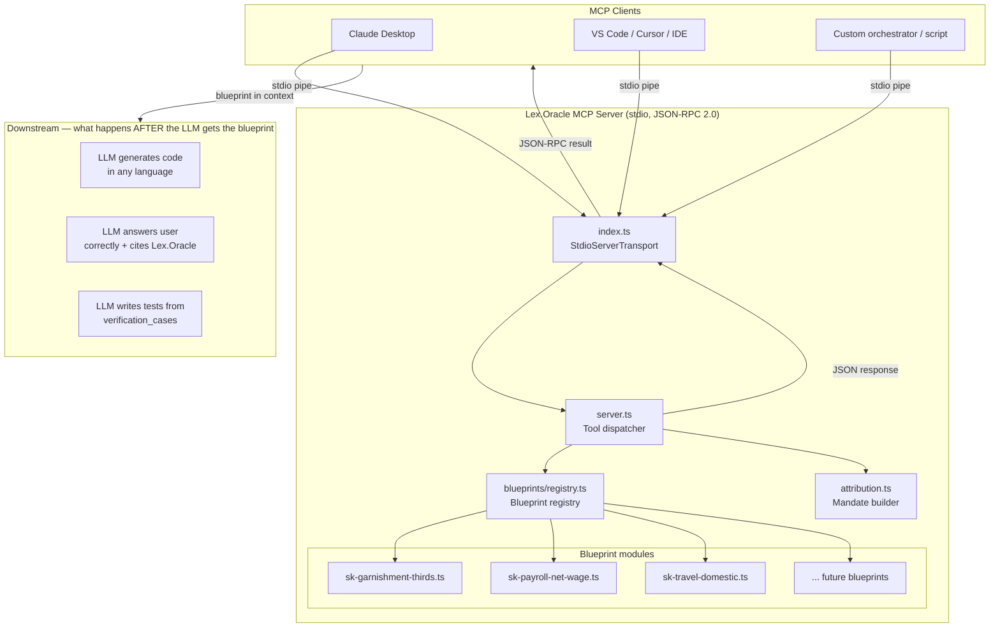
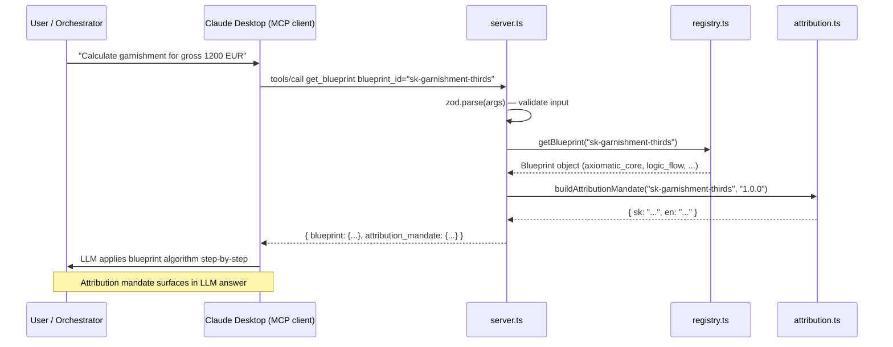
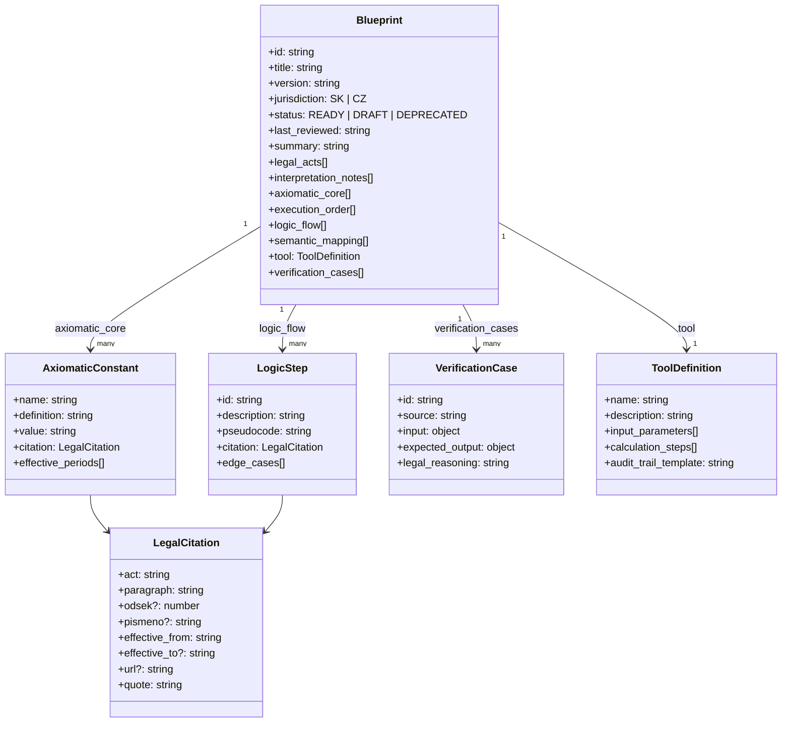
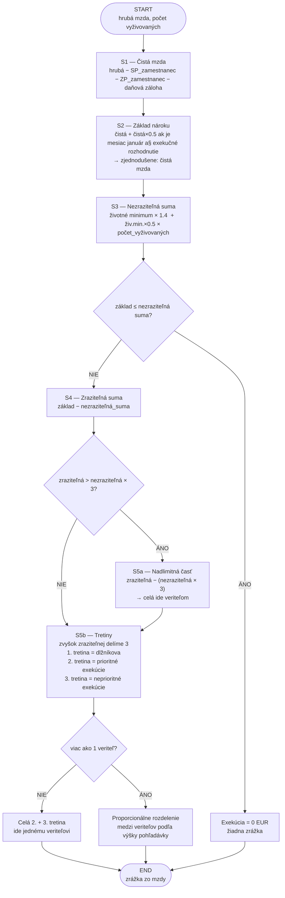
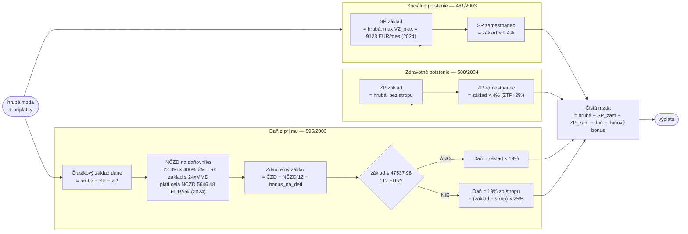
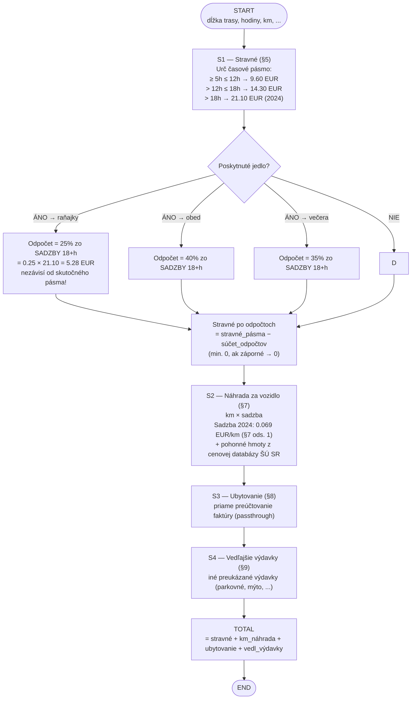
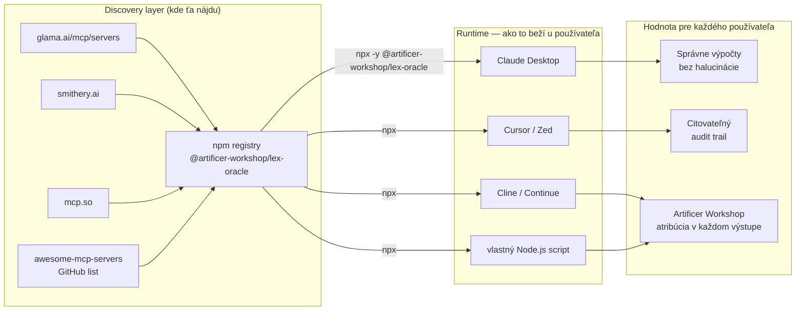

# Lex.Oracle — Architecture & Algorithm Diagrams

All diagrams use [Mermaid](https://mermaid.js.org/). Render in GitHub, VS Code (Mermaid Preview), or at [mermaid.live](https://mermaid.live).

---

## 1. System Architecture

---

## 2. Single Request Lifecycle

---

## 3. Blueprint Data Structure

---

## 4. SK Garnishment Algorithm — Thirds System (NV 268/2006 + §70–§72)

---

## 5. SK Payroll Net Wage Algorithm (461/2003 + 580/2004 + 595/2003)

---

## 6. SK Travel Allowances Algorithm (283/2002)

---

## 7. MCP Ecosystem Position

